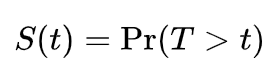
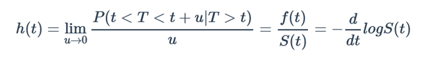
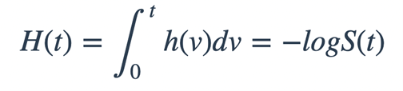
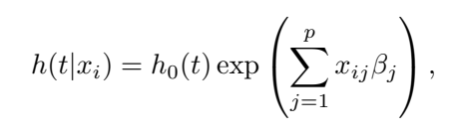

```{r setup, include=FALSE}
knitr::opts_chunk$set(echo = TRUE, warning = FALSE, message = FALSE, 
                      cache = TRUE, fig.width = 10, fig.height = 10)
```

```{r load_libraries, echo = FALSE}
library(ISLR2)
library(survival)
library(dplyr)
library(vembedr)
```

# Survival Analysis and Censored Data ----

**Learning objectives:**

- Describe how **censored data** impacts survival analysis.
- Calculate a **Kaplan-Meier survival curve.**
- Compare the survival rates of two groups with the **log-rank test.**
- Model survival data using **Cox's proportional hazards**
- Cox model assumptions
- Apply **shrinkage methods** to regularize the Cox model.
- Calculate the generalized **AUC** for a survival model.

# What is survival (censored) data?


Time-to-event data that consist of a distinct start time and end time

Examples:

- Time from surgery to death

- Time for customer to cancel a subscription (churn)

- Time to machine malfunction


# Aliases for survival analysis

Survival analysis is common in many other fields, such as:

- Reliability analysis

- Duration analysis

- Event history analysis

- Time-to-event analysis

# Introduction to Survival Analysis (zedstatistics) ---

<!-- `r knitr::include_url("https://www.youtube.com/embed/v1QqpG0rR1k")` -->

```{r video, echo=FALSE}
embed_youtube("v1QqpG0rR1k", ratio = "16by9") %>% 
     use_align("center")
```

# Types of censoring

Observations are __censored__ when the information about their survival time is incomplete.

Examples:

- Loss to follow-up

- Withdrawl from study

- No event/outcome by end of fixed study period

These are examples of **right** censoring.

Left censoring and interval censoring are also possible, but the most frequent is right censoring.

# Lab: Survival Analysis

In this lab, we perform survival analyses on three separate data sets. In Section 11.8.1 we analyze the `BrainCancer` data that was  first described in Section 11.3.

In Section 11.8.2, we examine the `Publication` data from Section 11.5.4. Finally, Section 11.8.3 explores a simulated call center data set.

## Brain Cancer Data
We begin with the `BrainCancer` data set, which is part of the  `ISLR2` package.

```{r dataset}
data("BrainCancer")
dim(BrainCancer)
head(BrainCancer)
```

The rows index the 88 patients, while the columns contain the 8 predictors.

```{r skim}
skimr::skim_without_charts(BrainCancer)
```

```{r}
BrainCancer %>% 
     count(status)
```


Before beginning an analysis, it is important to know how the `status` variable has been coded.  Most software, including `R`, uses the convention that `status = 1` indicates an uncensored observation,  and `status = 0` indicates a censored observation. But some scientists might use the opposite coding. For the `BrainCancer` data set $35$ patients died before the end of the study.

# Kaplan-Meier survival curve

To begin the analysis, we re-create  the Kaplan-Meier survival curve  shown in  Figure 11.2, using the `survfit()` function within the `R` `survival` library. Here `time` corresponds to $y_i$, the time to the $i$th event (either censoring or death).



```{r plot_KM_curve}
fit.surv <- survfit(Surv(time, status) ~ 1, data = BrainCancer)
plot(fit.surv, xlab = "Months",
    ylab = "Estimated Probability of Survival")
```

# KM curve stratified by sex

Next we create Kaplan-Meier survival curves that are stratified by `sex`, in order to reproduce Figure 11.3.

```{r KM_curve_sex}
fit.sex <- survfit(Surv(time, status) ~ sex, data = BrainCancer)
plot(fit.sex, xlab = "Months",
    ylab = "Estimated Probability of Survival", col = c(2,4))
legend("bottomleft", levels(BrainCancer$sex), col = c(2,4), lty = 1)
```

# Survminer package

Using `survminer` package
```{r survminer}
library(survminer)
ggsurvplot(fit.sex, data = BrainCancer, 
           pval = TRUE,
           conf.int = TRUE, 
           risk.table = TRUE, 
           legend.title = "Sex", 
           legend.labs = c("Female", "Male"))
```

# `ggsurvfit` package

Using `ggsurvfit` plot
```{r ggsurvit}
library(ggsurvfit)

survfit2(Surv(time, status) ~ sex, data = BrainCancer) %>% 
     ggsurvfit(linewidth =1) + 
     add_risktable() + 
     add_confidence_interval() + 
     add_pvalue() + 
     scale_ggsurvfit() + 
     labs(y = 'Recurrence-free Progression', 
          title = 'Brain Cancer KM Estimator Plot') + 
     ggeasy::easy_move_legend('top')
```

As discussed in Section 11.4, we can perform a log-rank test to compare the survival of males to females, using the `survdiff()` function.

```{r logrank_test}
logrank.test <- survdiff(Surv(time, status) ~ sex, data = BrainCancer)
logrank.test
```

The resulting $p$-value is $0.23$, indicating  no evidence of a difference in survival between the two sexes.

# Hazard Function

The hazard function (11.9) is defined at a given moment *t* in time, the potential risk of having an event given you survived up to time *t*.



It’s important to note here that the hazard is **not a probability** because we are dividing the probability by a time interval. Instead what we get is a rate. And since we are dealing with the condition of survival up to time t, this is why sometimes the hazard function is referred to as conditional failure rate.

Why do we care about the hazard function? It turns out that a key approach for modeling survival data as a function of covariates (i.e., regressors) relies heavily on the hazard function.

# Cumulative Hazard Function



Let's plot the cumulative hazard for the Brain cancer dataset with sex as covariate
```{r cum_hazard_plot}
ggsurvplot(fit.sex, 
           data = BrainCancer, 
           conf.int = TRUE, 
           risk.table.col = "strata", 
           legend.title = "Sex", 
           legend.labs = c("Female", "Male"), 
           fun = "cumhaz")
```

# Proportional Hazards

The *proportional hazards assumption* states that



It is important to emphasize that the relative risk does not depend on time, i.e. it is constant in time for the same pair of values of any feature, so hazards are proportional independent of time.

We can use some specific distribution for the baseline survival or hazard function – and then we get a **parametric PH model**, or do not make such assumptions about the baseline functions – and then get a **semi-parametric PH model**, often called a Cox PH model after its author.

# Regression Models

## Cox Proportional Hazards-Hazards Model

The **Cox proportional-hazards model (Cox, 1972)** is essentially a regression model commonly used statistical in medical research for investigating the association between the survival time of patients and one or more predictor variables.

The purpose of the model is to evaluate simultaneously the effect of several factors on survival. In other words, it allows us to examine how specified factors influence the rate of a particular event happening (e.g., infection, death) at a particular point in time. This rate is commonly referred as the hazard rate. Predictor variables (or factors) are usually termed *covariates* in the survival-analysis literature.

Let's fit the Cox proportional hazards models using the `coxph()`  function.
To begin, we consider a model that uses `sex` as the only predictor.
```{r coxph}
fit.cox <- coxph(Surv(time, status) ~ sex, data = BrainCancer)
summary(fit.cox)
```

Regardless of which test we use, we see that there is no clear evidence for a difference in survival between males and females.

Let's run the Cox PH model with all covariates.
```{r coxph_all}
fit_all_cox <- coxph(Surv(time, status) ~ ., data = BrainCancer)
summary(fit_all_cox)
```

## Visualizing the estimated distribution of survival times

Having fit a Cox model to the data, it’s possible to visualize the predicted survival proportion at any given point in time for a particular risk group. The function survfit() estimates the survival proportion, by default at the mean values of covariates.
```{r, coxph_viz}
# plot the baseline survival function
ggsurvplot(survfit(fit_all_cox), data = BrainCancer, palette = "#2E9FDF",
           ggtheme = theme_minimal())
```

Let's plot the Cox Proportional Hazards covariates coefficients estimates/CI
```{r}
library(ggstatsplot)
ggcoefstats(fit_all_cox, 
            title = "Cox PH Model Covariates Coefficients Estimates/CI"
            )
```


# Cox Model Assumptions

The Cox proportional hazards model makes several assumptions. Thus, it is important to assess whether a fitted Cox regression model adequately describes the data.

Here, we’ll discuss three types of diagnostics for the Cox model:

- Testing the proportional hazards assumption.

- Examining influential observations (or outliers).

- Detecting nonlinearity in relationship between the log hazard and the covariates.

# Testing proportional Hazard assumptions

The proportional hazards (PH) assumption can be checked using statistical tests and graphical diagnostics based on the *scaled Schoenfeld residuals*.

In principle, the *Schoenfeld residuals* are independent of time. A plot that shows a non-random pattern against time is evidence of violation of the PH assumption.
```{r coxtest1}
test.ph <- cox.zph(fit_all_cox)
test.ph
```

It’s possible to do a graphical diagnostic using the function *ggcoxzph()* [in the `survminer` package], which produces, for each covariate, graphs of the scaled Schoenfeld residuals against the transformed time.
```{r}
ggcoxzph(test.ph)
```

From the graphical inspection, there is no pattern with time. The assumption of proportional hazards appears to be supported for the model covariates.

# Testing influential observations

To test influential observations or outliers, we can visualize either:

- the deviance residuals or

- the dfbeta values

The function *ggcoxdiagnostics()* [in `survminer` package] provides a convenient solution for checking influential observations.
```{r}
ggcoxdiagnostics(fit_all_cox, type = "dfbeta", linear.predictions = FALSE, ggtheme = theme_bw())
```

It’s also possible to check outliers by visualizing the deviance residuals. The deviance residual is a normalized transform of the martingale residual. These residuals should be roughly symmetrically distributed about zero with a standard deviation of 1.

- Positive values correspond to individuals that “died too soon” compared to expected survival times.

- Negative values correspond to individual that “lived too long”.

- Very large or small values are outliers, which are poorly predicted by the model.

```{r}
ggcoxdiagnostics(fit_all_cox, type = "deviance", linear.predictions = FALSE, ggtheme = theme_bw())
```

The pattern looks fairly symmetric around 0.

# Testing non linearity

Often, we assume that continuous covariates have a linear form. However, this assumption should be checked.

Plotting the *Martingale residuals* against continuous covariates is a common approach used to detect *nonlinearity* or, in other words, to assess the functional form of a covariate. For a given continuous covariate, patterns in the plot may suggest that the variable is not properly fit.

Nonlinearity is not an issue for categorical variables, so we only examine plots of martingale residuals and partial residuals against a continuous variable.

Martingale residuals may present any value in the range (-INF, +1):

- A value of martinguale residuals near 1 represents individuals that “died too soon”,

- and large negative values correspond to individuals that “lived too long”.

To assess the functional form of a continuous variable in a Cox proportional hazards model, we’ll use the function *ggcoxfunctional()* [in the `survminer` R package].

The covariates must be numerical.

To test `sex`, it is necessary to convert the covariate to numerical.
```{r}
BC_sex <- BrainCancer %>% 
     mutate(sex = sex %>% as.numeric())

ggcoxfunctional(Surv(time, status) ~ sex + log(sex) + sqrt(sex), data = BC_sex)
```

The function *ggcoxfunctional()* displays graphs of continuous covariates against martingale residuals of null cox proportional hazards model. This might help to properly choose the functional form of continuous variable in the Cox model. Fitted lines with lowess function should be **linear** to satisfy the Cox proportional hazards model assumptions.  Inthis case, the covariate `sex` passes the test.

Let's test `gtv`
```{r}
ggcoxfunctional(Surv(time, status) ~ gtv + log(gtv) + sqrt(gtv), data = BrainCancer)
```

From the plot, the covariate `gtv` exhibits a nonlinear pattern.

## Meeting Videos

### Cohort 1

`r knitr::include_url("https://www.youtube.com/embed/URL")`

<details>
<summary> Meeting chat log </summary>

```
ADD LOG HERE
```
</details>

### Cohort 2

`r knitr::include_url("https://www.youtube.com/embed/URL")`

<details>
<summary> Meeting chat log </summary>

```
ADD LOG HERE
```
</details>

### Cohort 3

`r knitr::include_url("https://www.youtube.com/embed/URL")`

<details>
<summary> Meeting chat log </summary>

```
ADD LOG HERE
```
</details>
